# Azure Update Manager Lab — Patch Management with Terraform

# Loom video Documentation link: https://www.loom.com/share/08218a407ae648709c9c75f1b9db1708

A fully automated, modular patch-management environment on Microsoft Azure, built end-to-end with Terraform. The lab provisions a small Windows domain (one domain controller and two workstations), enrolls every machine in **Azure Update Manager**, defines a weekly maintenance schedule, enforces periodic assessment through Azure Policy, and produces an on-demand JSON compliance report.

The goal is not just to deploy infrastructure, but to demonstrate a **reproducible, recoverable, and secure** infrastructure-as-code workflow — including how real Azure constraints (quotas, capacity, policy prerequisites) are diagnosed and resolved.

---

## Architecture

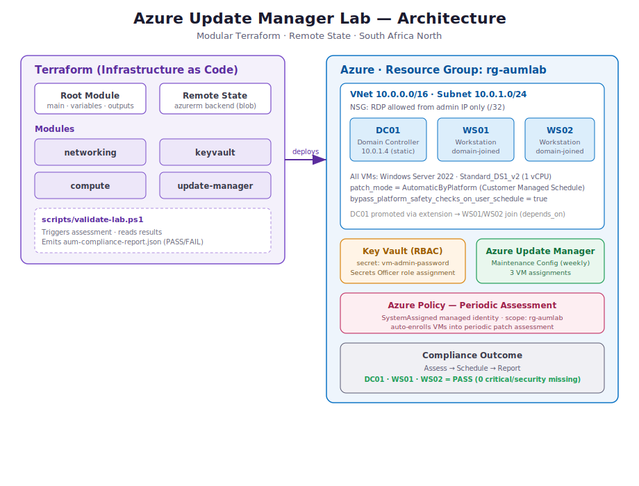

The environment is composed of:

- **A modular Terraform codebase** with a root module orchestrating four child modules (`networking`, `keyvault`, `compute`, `update-manager`), backed by remote state in an Azure Storage account.
- **A Windows domain**: `DC01` is promoted to a domain controller for `aumlab.local`; `WS01` and `WS02` join the domain. DC01 holds a static private IP (`10.0.1.4`) so it can serve as a stable DNS target.
- **An RBAC-enabled Key Vault** storing the VM administrator password as a secret. The password is never written to disk — it is supplied via an environment variable at deploy time.
- **Azure Update Manager**: a weekly maintenance configuration with three per-VM assignments, plus an Azure Policy assignment (with a system-assigned managed identity) that enrolls the VMs in periodic assessment.
- **A PowerShell validation script** that triggers assessment, evaluates compliance, and exports `aum-compliance-report.json`.

---

## Repository structure

```
azure-update-manager-lab/
├── backend.tf                 # Remote state (azurerm backend)
├── versions.tf                # Provider + Terraform version constraints
├── variables.tf               # Root input variables
├── main.tf                    # Root module — wires the four modules together
├── outputs.tf                 # Public IPs, Key Vault name, resource group
├── terraform.tfvars           # Local values (gitignored)
├── terraform.tfvars.example   # Safe template (committed)
├── .gitignore
├── modules/
│   ├── networking/main.tf     # VNet, subnet, NSG, NSG association
│   ├── keyvault/main.tf       # Key Vault (RBAC), role assignment, secret
│   ├── compute/main.tf        # 3 VMs, DC promotion, domain joins, patch settings
│   └── update-manager/main.tf # Maintenance config, assignments, assessment policy
└── scripts/
    └── validate-lab.ps1       # Compliance assessment + JSON report
```

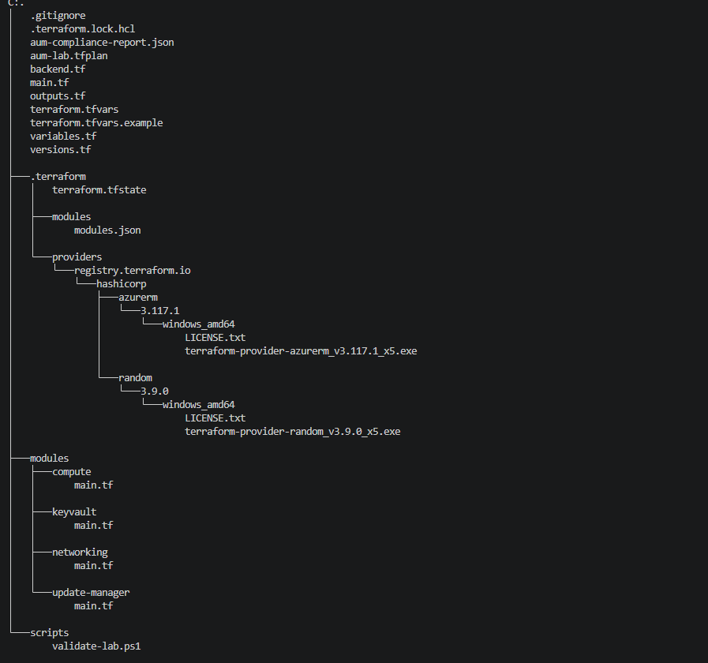

---

## Prerequisites

| Requirement | Notes |
|---|---|
| Terraform | >= 1.5.0 |
| Azure CLI | Recent version, authenticated (`az login`) |
| PowerShell 7 | Required to run the validation script with the `Az` module |
| Az PowerShell module | `Install-Module Az -Scope CurrentUser` |
| Azure subscription | With an existing storage account for remote state |
| Resource providers | `Microsoft.Maintenance` and `Microsoft.GuestConfiguration` registered |

Register the required providers before deploying:

```powershell
az provider register --namespace Microsoft.Maintenance
az provider register --namespace Microsoft.GuestConfiguration
```

---

## Deployment

### 1. Configure variables

Copy the example tfvars and set your values:

```powershell
Copy-Item terraform.tfvars.example terraform.tfvars
```

Edit `terraform.tfvars`:

```hcl
location            = "southafricanorth"
resource_group_name = "rg-aumlab"
admin_username      = "labadmin"
allowed_rdp_ip      = "YOUR_PUBLIC_IP/32"   # find at whatismyip.com
domain_name         = "aumlab.local"
domain_netbios      = "AUMLAB"
```

Set the admin password as an environment variable (never in a file):

```powershell
$env:TF_VAR_admin_password = "YourStrongPassword123!"
```

Point `backend.tf` at your remote-state storage account, using a unique state key for this lab:

```hcl
terraform {
  backend "azurerm" {
    resource_group_name  = "RG-TerraformState"
    storage_account_name = "YOUR_STORAGE_ACCOUNT"
    container_name       = "tfstate"
    key                  = "aum-lab.tfstate"
  }
}
```

### 2. Initialize, plan, apply

```powershell
terraform init
terraform plan -out aum-lab.tfplan
terraform apply "aum-lab.tfplan"
```

Deployment takes roughly 15–25 minutes — the domain-controller promotion is the longest step. Because the workstation domain-join extensions use `depends_on`, they wait until DC01 is fully promoted.

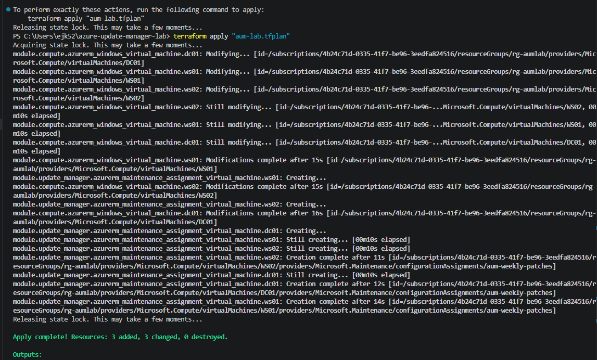

### 3. Trigger assessment and validate

```powershell
az vm assess-patches --resource-group rg-aumlab --name DC01
az vm assess-patches --resource-group rg-aumlab --name WS01
az vm assess-patches --resource-group rg-aumlab --name WS02

.\scripts\validate-lab.ps1 -ResourceGroup rg-aumlab -SubscriptionId <your-subscription-id>
```

---

## Results

### Resource group — everything deployed

All lab resources provisioned in `rg-aumlab` (South Africa North).

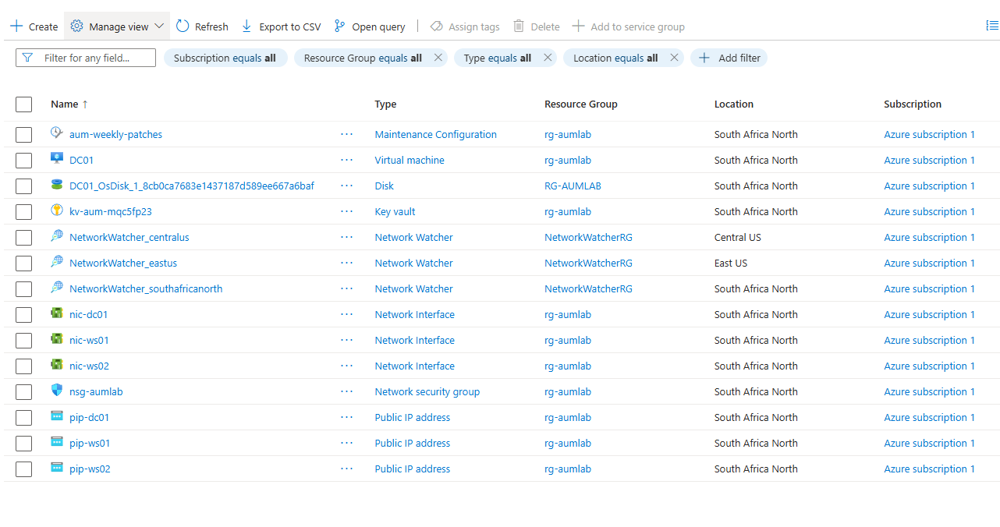

### Azure Update Manager — machines enrolled

All three machines are enrolled and configured for **Customer Managed Schedules** — confirming the patch-orchestration configuration is correct.

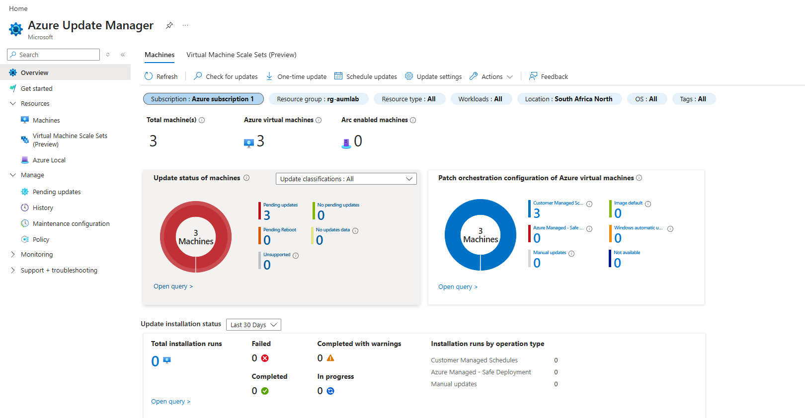

### Maintenance configuration — weekly schedule

The `aum-weekly-patches` configuration: weekly recurrence, a three-hour maintenance window, reboot-if-required.

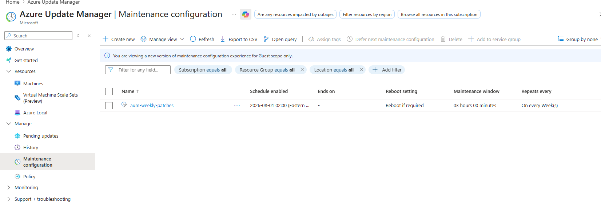

### Pending updates — assessment working

Assessment correctly identifies the available update (Windows Malicious Software Removal Tool, an `UpdateRollup`) across all three machines — with no missing critical or security patches.

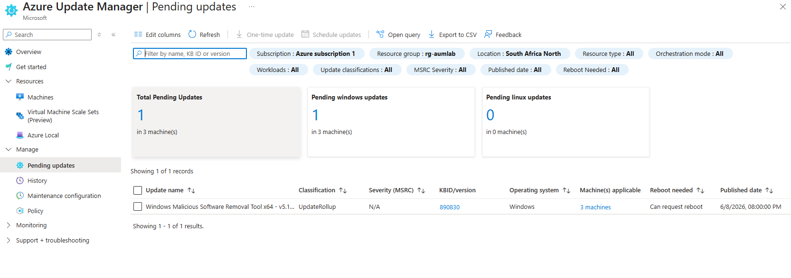

### Azure Policy — periodic assessment enrollment

The built-in periodic-assessment policy assigned at the resource-group scope.

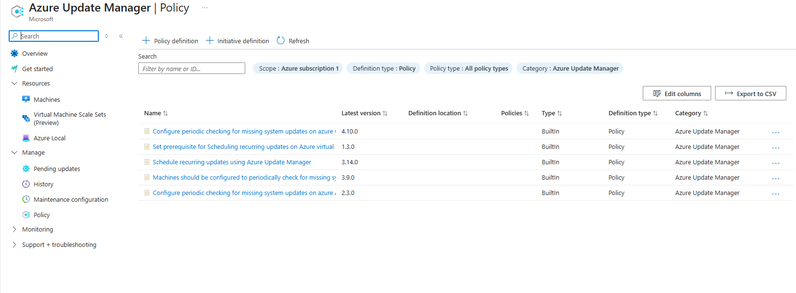

### Key Vault — secret storage

The RBAC-enabled `kv-aum-*` vault holding the VM admin password.

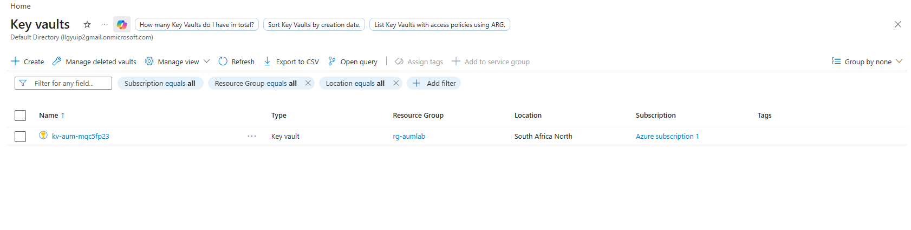

### DC01 — VM properties

`DC01` running Windows Server 2022 on `Standard_DS1_v2` in South Africa North.

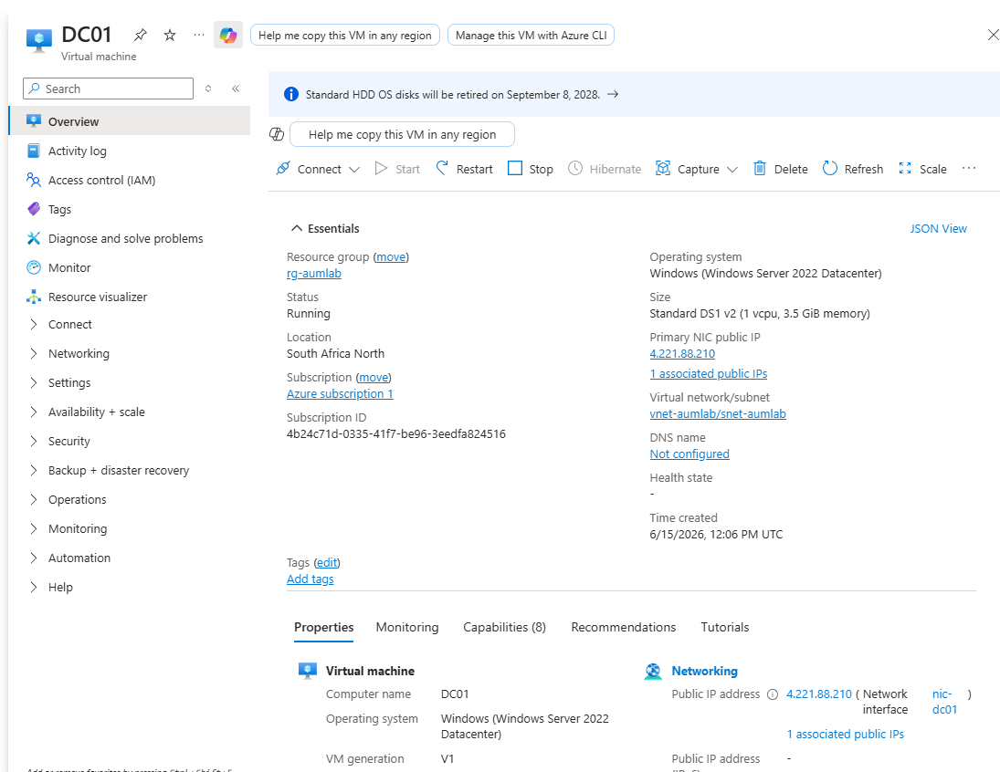

### Validation output — ALL PASS

```
=== Azure Update Manager Compliance Validation ===
[PASS] DC01 -- Critical missing: 0 | Status: Succeeded
[PASS] WS01 -- Critical missing: 0 | Status: Succeeded
[PASS] WS02 -- Critical missing: 0 | Status: Succeeded

Overall: ALL PASS
Report exported: aum-compliance-report.json
```

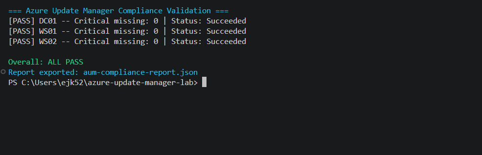

### Compliance report (JSON)

The exported report — machine-readable, suitable for feeding a SIEM, ticketing system, or audit archive.

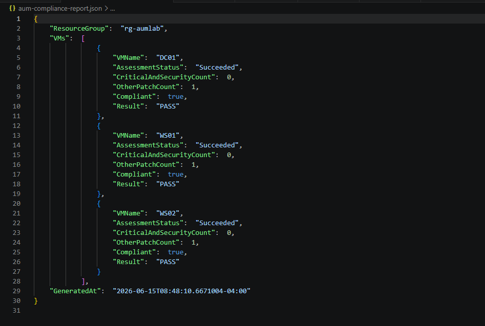

---

## Engineering notes — real constraints solved

This lab deliberately documents the issues encountered, because diagnosing and resolving them is the substance of the work.

| Problem | Symptom | Resolution |
|---|---|---|
| **vCPU quota** | Region capped at 4 vCPUs; default sizing needed 6 | Right-sized VMs to 1-vCPU SKUs |
| **Public IP limit** | Max 3 public IPs per region; a prior lab held all 3 | Cleanly destroyed the older environment with Terraform to free addresses |
| **SKU capacity** | `Standard_B1ms` returned `SkuNotAvailable` | Queried available SKUs and pivoted to `Standard_DS1_v2` |
| **Policy identity** | `ResourceIdentityRequired` on the assessment policy | Added a `SystemAssigned` identity and `location` to the policy assignment |
| **Patch orchestration** | `UnsupportedResourceOperation` linking VMs to the schedule | Set `patch_mode = AutomaticByPlatform` and `bypass_platform_safety_checks_on_user_schedule_enabled = true` on each VM |

Because Terraform tracks state, every fix-and-rerun cycle created only the missing resources and never destroyed working ones — the core advantage of an incremental, recoverable IaC workflow.

---

## Security considerations

- **No secrets in source control.** The admin password is passed via `TF_VAR_admin_password` and stored in Key Vault; `terraform.tfvars` and all state files are gitignored.
- **RBAC authorization** on Key Vault rather than legacy access policies.
- **Least-exposure networking.** The NSG permits RDP only from a single administrator IP (`/32`), not the public internet.

> **Note:** This is a lab. The domain-controller DSRM password is hardcoded in the bootstrap extension for demonstration only and must never be done in production.

---

## Teardown

```powershell
terraform destroy
```

The remote-state storage account lives in a separate resource group and is intentionally **not** managed by this lab, so teardown leaves it (and any other labs' state) untouched.

---

## Tech stack

Terraform · Azure CLI · PowerShell · Azure Update Manager · Azure Policy · Azure Key Vault · Windows Server 2022 · Active Directory Domain Services
